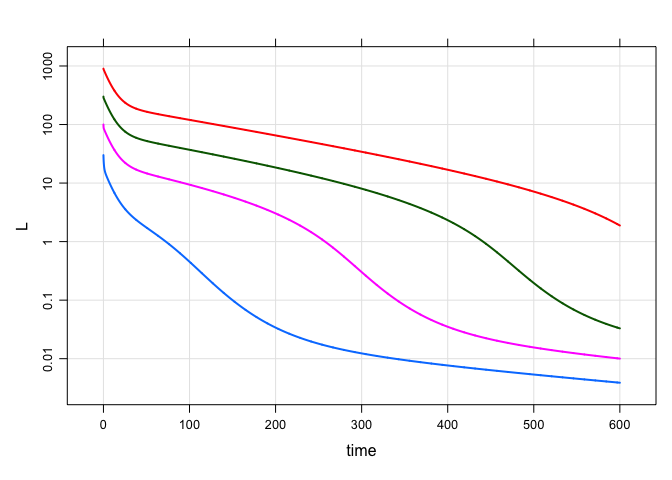
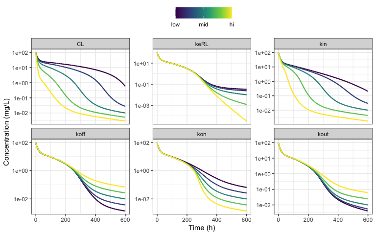

Model: tmdd
================

- [Reference](#reference)
- [Example](#example)
- [Sensitivity analysis](#sensitivity-analysis)
- [Code](#code)

# Reference

**Note**: this is the general, fully-parameterized TMDD model.

    Peletier LA, Gabrielsson J. Dynamics of target-mediated drug
    disposition: characteristic profiles and parameter identification. 
    J Pharmacokinet Pharmacodyn. 2012 Oct;39(5):429-51. 
    doi: 10.1007/s10928-012-9260-6. Epub 2012 Aug 1. PMID: 22851162; 
    PMCID: PMC3446204.

# Example

This simulation replicates Figure 3 in the paper.

``` r
library(depot)
library(dplyr)
library(mrgsim.sa)
```

``` r
mod <- depot("tmdd", end = 600, delta = 0.1) 
```

Doses

- 1.5 mg/kg
- 5.0 mg/kg
- 15 mg/kg
- 45 mg/kg

``` r
e <- expand.ev(amt = c(1.5, 5, 15, 45))
```

Note that these are mg/kg doses. Model parameters are also
weight-normalized.

``` r
mod %>% mrgsim_e(e) %>% plot(L ~time, logy = TRUE)
```

<!-- -->

# Sensitivity analysis

- Run on just the 5 mg/kg dose
- each parameter is varied between $\pm 2\sigma$ of log-normal
  distribution with 100% coefficient of variation

``` r
out <- mod %>%  
  parseq_cv(keRL, koff, kon, kout, kin, CL,   .cv = 100) %>%
  ev(amt = 5) %>% 
  update(outvars = "L") %>%
  sens_each(recsort = 3) 
```

``` r
sens_plot(
  out, 
  "L", 
  logy = TRUE, 
  plot_ref = FALSE,
  xlab = "Time (h)", 
  ylab = "Concentration (mg/L)"
) 
```

<!-- -->

Check the actual values

``` r
out %>% 
  filter(time==0) %>% 
  group_by(p_name) %>% 
  summarise(
    lo = min(p_value), 
    mid = median(p_value), 
    hi = max(p_value)
  ) %>% knitr::kable()
```

| p_name |        lo |   mid |        hi |
|:-------|----------:|------:|----------:|
| CL     | 0.0001353 | 0.001 | 0.0073891 |
| keRL   | 0.0004060 | 0.003 | 0.0221672 |
| kin    | 0.0148869 | 0.110 | 0.8127962 |
| koff   | 0.0001353 | 0.001 | 0.0073891 |
| kon    | 0.0123155 | 0.091 | 0.6724041 |
| kout   | 0.0012180 | 0.009 | 0.0665015 |

# Code

``` c
[ param ]

Vt = 0.1
CLd = 0.003
CL = 0.001
kon = 0.091
koff = 0.001
kin = 0.11
kout = 0.009
keRL = 0.003
R0 = 12
Vc = 0.05;

[ cmt ] L R RL T

[ pk ]

R_0 = R0;

double keL = CL/Vc;

F_L = 1/Vc;

[ des ]

dxdt_L = - kon * L * R + koff * RL - keL * L - (CLd/Vc) * L + (CLd/Vt) * T;

dxdt_R = kin - kout * R - kon * L * R + koff * RL;

dxdt_RL = kon * L * R - (koff + keRL) * RL;

dxdt_T = (CLd/Vc) * L - (CLd/Vt) * T;

[ capture ] CP = L
```
